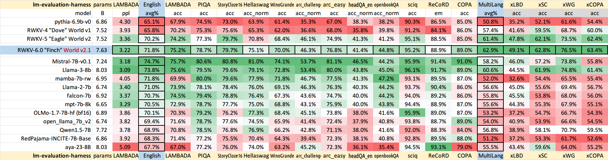

# Neptun AI

## Base Model

RNN with transformer-level LLM performance.  
Model Repository: [RWKV](https://github.com/BlinkDL/RWKV-LM).  
Website: [rwkv.com](https://www.rwkv.com).

It's combining the best of RNN and transformer:

- great performance,
- fast inference,
- saves VRAM,
- fast training,
- "infinite" ctx_len,
- and free sentence embedding.

The base model (rwkv-5-world (latest stable rwkv)) supports 12 languages and is trained on 4 datasets.

### Benchmarks



Doesn't look bad next to mistral and llama3.

### Running The Base Model Demo

Go to [huggingface.co/BlinkDL/rwkv-5-world](https://huggingface.co/BlinkDL/rwkv-5-world/blob/main/RWKV-5-World-7B-v2-20240128-ctx4096.pth) and [download](https://huggingface.co/BlinkDL/rwkv-5-world/resolve/main/RWKV-5-World-7B-v2-20240128-ctx4096.pth) the model.

```bash
cd RWKV
```

```bash
pip install -r requirements.txt
```

```bash
python chat.py
```
